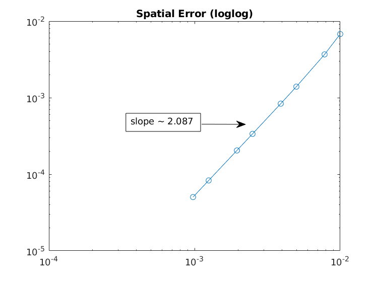
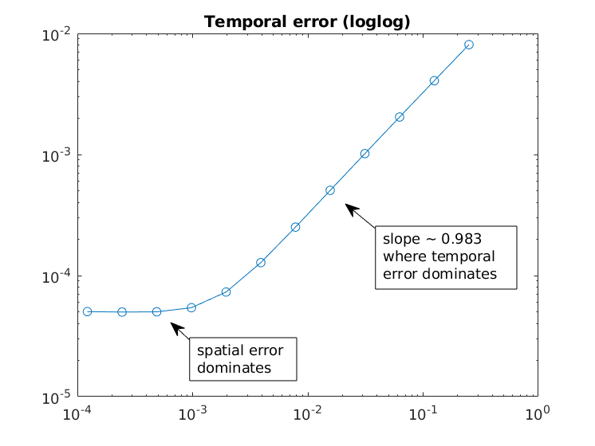

# phasefield
Code for the Allen-Cahn benchmark problem here:

https://pages.nist.gov/pfhub/benchmarks/benchmark7.ipynb/

I first tried the Forward-Euler finite differences scheme (with second order in space), but measuring convergence in time was tricky because the spatial error always dominates anywhere the scheme is stable. So, I switched to a Forward-Backward scheme with implicit linear part and explicit linear part. The scheme is stable enough to allow large time steps to meaninfully measure time convergence.

## Compliation
I wrote my code in C++14 so this requires a relative new compiler. 
You can just call
```bash
make
```

## Part a) convergence test
Here is my plot for the spatial error, as specified in the benchmark problem.

The spatial order of accuracy matches the theoretical one (second order).


The temporal order of accuracy matches the theoretical one (first order). However, when the time step size is small enough, the spatial error starts dominating.